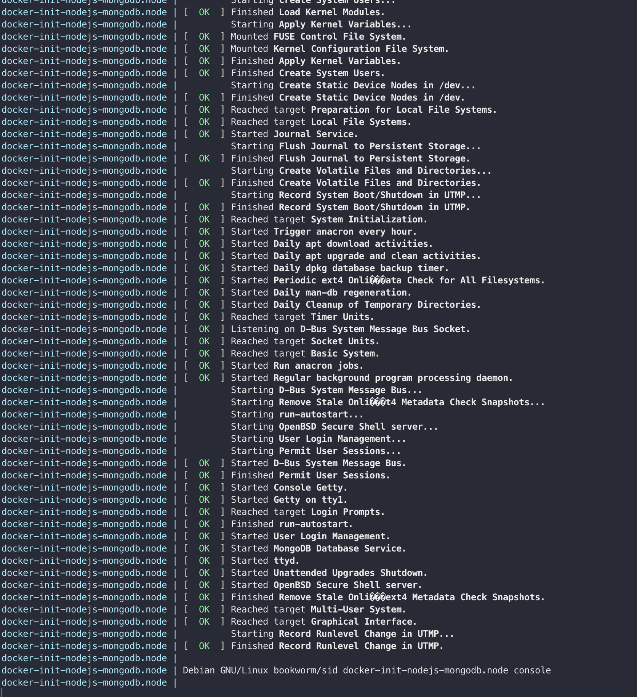

<!-- https://github.com/nestjsx/crud -->

<div align="center">
  <h1>:point_right:<a href="https://github.com/maccallios/nestjs-typeorm-mongodb-swagger">
  Docker with systemd init
  </a></h1>
</div>

<div align="center">
  <strong>Install and run systemd *.service files inside Docker container</strong>
</div>

<br />



Lightweight containers have popularized the idea of running a single process or service without normal init systems like systemd.

However, omitting an init system often leads to incorrect handling of processes and signals, and can result in problems such as containers which can't be gracefully stopped, or leaking containers which should have been destroyed.

## Why you need an init system

Normally, when you launch a Docker container, the process you're executing becomes PID 1, giving it the responsibilities that come with being the init system for the container.

In most cases, signals won't be handled properly.

### There are two common issues this presents:

1)  The Linux kernel applies special signal handling to processes which run as PID 1.

    When processes are sent a signal on a normal Linux system, the kernel will first check for any custom handlers the process has registered for that signal, and otherwise fall back to default behavior (for example, killing the process on SIGTERM).

    A common example is CI jobs that do docker run my-container script: sending SIGTERM to the docker run process will typically kill the docker run command, but leave the container running in the background.

2)  Orphaned zombie processes aren't properly reaped.

    A process becomes a zombie when it exits, and remains a zombie until its parent calls some variation of the wait() system call on it. It remains in the process table as a "defunct" process. Typically, a parent process will call wait() immediately and avoid long-living zombies.

    If a parent exits before its child, the child is "orphaned", and is re-parented under PID 1. The init system is thus responsible for wait()-ing on orphaned zombie processes.

    Of course, most processes won't wait() on random processes that happen to become attached to them, so containers often end with dozens of zombies rooted at PID 1.

## Prerequisites

Make sure you have installed all of the following prerequisites on your development machine:

* Docker
* docker-compose
* openssl for password generation.

before you begin, there are some env's which can be customized,
see below

```bash
DOCKER_NETWORK_NET_W1_BASE=${DOCKER_NETWORK_NET_W1_BASE:-172.16.231}
DOCKER_NETWORK_NET_W1_SUBNET=${DOCKER_NETWORK_NET_W1_BASE}.0/24
DOCKER_NETWORK_NET_W1_IP_RANGE=${DOCKER_NETWORK_NET_W1_BASE}.0/24

CONTAINER_MAIN_IP=${DOCKER_NETWORK_NET_W1_BASE}.101
DOCKER_SERVICE=node
```

This scripts creates new docker network with fixed ip range,
the container also got a fixed IP based on this network.

That way we can use VPN such as Wireguard to easily access our containers
without exposing them outside.

The network subnet can be customized.

Bash function `create_docker_network_if_not_exist` takes three arguments which is
  * name,     default is `net-w1`
  * subnet,   default is `172.16.231.0/24`
  * ip range, default is `172.16.231.0/24`

If the named network does not exist, it creates one.

Bash function `gen_ssh_keys` creates ssh keys for sshd.

The contaiuner also runs ttyd service which a web ssh alternative.
Ttyd service runs on port 8020 by default and has HTTP basic auth,
the username and password should be in container/ttyd_pass file.

Because our Entrypoint is now init, we cannot use env variables and 
we generate and set the passwords via files.
For every consecutive run the password files remains the same (not overwritten)

## Getting Started

```bash
git clone https://github.com/maccallios/nestjs-typeorm-mongodb-swagger
cd nestjs-typeorm-mongodb-swagger
./run-container.sh
```

The scripts build the main image with NodeJS, pnpm and mongodb.
It also creates simple zsh environment.

`container/id_rsa` file would be ssh private key.

HTTP auth login and password for ttyd in `container/ttyd_pass` file.

The compose links the .zsh_history file, shell history saved in `container.zsh_history`.


Please note, this container runs in `privileged` mode.

The service files are in `/etc/systemd/system`.

Here is the example for a service file

```bash
[Unit]
Description=run-autostart
After=basic.target
After=network.target
DefaultDependencies=no

[Service]
Type=oneshot
RemainAfterExit=true
WorkingDirectory=/root
ExecStart=/root/run-autostart.sh
KillMode=process

[Install]
WantedBy=multi-user.target
```

This service called run-autostart.service and sets the sshd authorized_keys file and ttyd password.

After run-autostart.service exits we run mongodb and ttyyd.

Systemctl is well documented and its manpage here: [https://www.freedesktop.org/software/systemd/man/systemctl.html](https://www.freedesktop.org/software/systemd/man/systemctl.html)

Here are few useful commands:
  * `systemctl daemon-reload` should be run if any files changed to reload
  * `journalctl -n 100 -f -u mongodb.service` shows last 20 lines from service log and follows
  * `systemctl status mongodb.service` shows the status

Ports:
  * ssh is on port 2022
  * ttyd on port 8022
  * port 3000 exposed and is available

You can use CTRL+R to navigate through shell history, with fzf search.

Its possible to get into running conatiner shell from command line by `docker-compose exec node zsh` command from the project folder.
